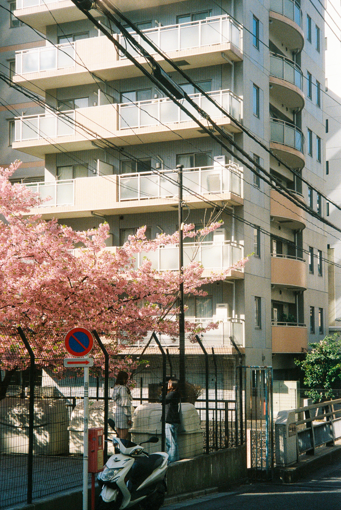

# Yoonmin Film Archive

#### [ 사진 아카이브 플랫폼 ] 작품과 커머셜 작업을 한곳에 담아내는 디지털 갤러리
<div align="center">
  
</div>

<div align="center">
  <a href="FrontEnd/README.md">
    
  </a>
</div>

> 필름과 디지털 작품을 온라인으로 전시하고 문의를 자동으로 수집하는 포트폴리오 허브입니다.  
> React 프론트엔드와 AWS Serverless 백엔드가 작품 전시부터 카카오 알림까지 모두 책임집니다.

<div align="center">

| [📖 **프로젝트 소개**](#-프로젝트-소개) | [✨ **주요 기능**](#-주요-기능) |
| --- | --- |
| [🛠 **기술 스택**](#-기술-스택)   | [🚀 **설치 방법**](#-설치-방법) |

</div>

## 📖 프로젝트 소개

### 개요

Yoonmin Film Archive는 사진 작가 윤성민의 디지털/필름 작품과 커머셜 프로젝트를 한곳에 모아 전시하는 풀스택 웹 애플리케이션입니다.  
섹션별 갤러리를 통해 장르와 촬영 기법을 감상하고, 접수된 문의는 자동으로 저장·알림 처리되어 커뮤니케이션을 돕습니다.

### 프로젝트 비전

`빛과 도시, 사람의 이야기를 기록하는 아카이브`라는 목표 아래 다음을 지향합니다.

- 작품 소비자가 쉽게 탐색할 수 있는 직관적 웹 전시 경험
- 작품 데이터와 이미지를 안전하게 관리할 수 있는 CDN 기반 인프라
- 문의 접수부터 응답까지 자동화된 작가 워크플로우
- 향후 `Shop` 영역 확장을 염두에 둔 모듈형 구조

## ✨ 주요 기능

### 🖼️ 몰입형 온라인 갤러리
<div align="center">
  
</div>
디지털/필름/도시 패턴 등 카테고리별로 작품을 큐레이션하며 Masonry 그리드와 모달 뷰로 감상할 수 있습니다.  
JSON 메타데이터로 프로젝트 섹션을 제어하여 이미지 추가/수정이 간편합니다.

> - #### 📱 반응형 UI
>   React-Bootstrap과 커스텀 스타일로 모바일부터 데스크톱까지 자연스러운 레이아웃을 제공합니다.
>
> - #### 🚀 지연 로딩 & 애니메이션
>   `react-lazy-load-image-component`와 Framer Motion으로 부드러운 전환과 빠른 로딩을 구현했습니다.

### 📮 자동화된 문의 응답
<div align="center">
  
</div>
About 페이지의 오버레이 폼에서 문의를 전송하면 백엔드가 S3 저장 및 카카오톡 알림을 처리합니다.  
로컬에서는 Express JSON 스토어로 빠르게 테스트하고, 운영 환경에서는 AWS Serverless 인프라가 동일 로직을 수행합니다.

> - #### 📦 S3 기반 데이터 보관
>   문의 데이터를 JSON 형태로 S3에 저장하여 비용 효율성과 접근성을 확보했습니다.
>
> - #### 🔔 카카오 나에게 보내기
>   문의가 접수되면 Lambda가 카카오톡 알림을 발송해 실시간 확인이 가능합니다.

## 🛠 기술 스택

<div align="center">
  
  
  
</div>

| 구분 | 사용 기술 |
| --- | --- |
| Frontend | React 18, React Router, React-Bootstrap, Framer Motion, react-lazy-load-image-component, Axios |
| Backend (로컬) | Node.js, Express, body-parser, fs, Axios |
| Backend (Serverless) | AWS Lambda, API Gateway, S3, AWS SDK v3, Serverless Framework |
| Infra & 기타 | CloudFront/S3 CDN, Kakao Talk Memo API, Pretendard 폰트 |

## 🏗️ 시스템 아키텍처

```mermaid
graph TD
  U[사용자 브라우저]

  subgraph Frontend
    FE[React 18 SPA<br/>React Router · React-Bootstrap<br/>Framer Motion · Lazy Load · Axios]
    CDN[CloudFront/S3 CDN<br/>`REACT_APP_CDN_URL`]
  end

  subgraph Backend_Local[Backend (로컬)]
    BEExpress[Express API (Node.js 18)<br/>body-parser · fs · Axios]
    LocalStore[로컬 JSON 데이터 스토어]
  end

  subgraph Backend_Serverless[Backend (Serverless)]
    APIGW[API Gateway]
    LambdaInquiry[AWS Lambda Inquiry Handler<br/>Node.js · AWS SDK v3]
    S3Inquiry[S3 문의 데이터]
    LambdaKakao[Kakao Talk 알림 Lambda]
    KakaoAPI[Kakao Talk Memo API]
  end

  U -->|HTTPS| FE
  FE -->|이미지 요청| CDN
  FE -->|REST /inquiries| BEExpress
  BEExpress -->|저장| LocalStore

  FE -->|REST /inquiries| APIGW
  APIGW --> LambdaInquiry
  LambdaInquiry -->|저장| S3Inquiry
  LambdaInquiry -->|트리거| LambdaKakao
  LambdaKakao -->|알림| KakaoAPI
```

## 🚀 설치 방법

### 공통 준비

1. Node.js 18 이상 설치
2. npm 혹은 pnpm 사용 (project lockfile은 npm 기준)
3. AWS 계정 및 Serverless Framework CLI 준비 (배포 시)

### 프론트엔드 (React)

```bash
cd FrontEnd
npm install
npm start
```

- 개발 URL: `http://localhost:3000`
- `.env`에 `REACT_APP_API_BASE_URL`, `REACT_APP_CDN_URL`을 설정해 API와 CDN을 연결하세요.
- 프로덕션 빌드: `npm run build`

### 백엔드 (로컬 Express)

```bash
cd BackEnd
npm install          # 루트 package.json 사용
node api/inquiry/inquiryAPI.js
```

- 기본 포트는 `5002`이며 코드 상단 상수로 변경할 수 있습니다.
- 문의 수신 시 `api/inquiry/inquiryData.json`에 바로 저장됩니다.
- 카카오 알림 URL은 `KAKAO_NOTIFICATION_URL` 상수나 환경 변수로 주입하세요.

### Serverless 배포

```bash
cd BackEnd/api/inquiry
npm install
serverless deploy --stage dev
```

- `BackEnd/api/kakaoTalkAlam` 디렉터리도 동일 절차입니다.
- `.env` 또는 Parameter Store에 민감 정보를 저장하고 Serverless Framework로 주입합니다.
- S3 버킷과 API Gateway 경로는 `serverless.yml` 커스텀 설정을 확인하세요.

## 💡 사용법

### 1. 갤러리 구성

1. `FrontEnd/public/imageJson/*.json`에 작품 메타데이터를 추가합니다.
2. S3 또는 CDN에 이미지를 업로드하고 `getImageUrl` 헬퍼를 통해 노출합니다.
3. 필요한 경우 `FrontEnd/src/features/projectPage/pages`에 신규 페이지를 생성하고 라우팅합니다.

### 2. 문의 플로우

1. 프론트엔드 `.env`의 `REACT_APP_API_BASE_URL`을 로컬 서버 또는 배포된 API Gateway URL로 설정합니다.
2. 카카오 알림을 사용할 경우 Serverless Lambda에 토큰 및 URL을 환경 변수로 주입합니다.
3. 문의 전송 후 Express 또는 Lambda 로그로 저장/알림 여부를 확인합니다.

### 3. 운영 팁

- CDN URL만 교체하면 이미지 제공처를 쉽게 전환할 수 있으므로 스테이지별 `.env` 파일을 분리하세요.
- 문의 데이터는 S3 버전 관리와 함께 보관하면 복구와 감사 추적에 유리합니다.

## 🔧 환경 설정

### FrontEnd/.env

| 변수 | 설명 | 기본값 |
| --- | --- | --- |
| `REACT_APP_API_BASE_URL` | 문의 API 베이스 URL | `http://localhost:5002` |
| `REACT_APP_CDN_URL` | 이미지 CDN/S3 루트 경로 | `https://yoonminfilm-images.s3.ap-northeast-2.amazonaws.com` |

### BackEnd (Serverless)

| 변수 | 설명 |
| --- | --- |
| `S3_BUCKET` | 문의 데이터를 저장할 S3 버킷 이름 |
| `KAKAO_NOTIFICATION_URL` | 카카오 알림 Lambda(API Gateway) 엔드포인트 |
| `KAKAO_REST_API_KEY` | 카카오 OAuth REST API 키 |
| `KAKAO_ACCESS_TOKEN` | 카카오 나에게 보내기 액세스 토큰 |
| `KAKAO_REDIRECT_URI` | 카카오 OAuth 콜백 URL |
| `WEB_URL` | 안내 메시지에 포함될 웹 URL (선택) |

> 운영 환경에서는 AWS Systems Manager Parameter Store나 Secrets Manager에 민감 정보를 저장하는 것을 권장합니다.

## 🗂️ 디렉터리 구조

```text
.
├── FrontEnd                # React SPA 소스
│   ├── public              # 정적 파일 및 imageJson 메타데이터
│   └── src
│       ├── components      # 공통 네비게이션/푸터/오버레이
│       ├── config          # CDN URL 헬퍼
│       └── features        # 페이지 도메인 단위 모듈(Main, Project, About 등)
├── BackEnd                 # Node.js & Serverless 코드
│   └── api
│       ├── inquiry         # 문의 API (Express & Lambda)
│       ├── kakaoTalkAlam   # 카카오 알림 API (Express & Lambda)
│       └── frontend-examples
└── ProjectImageStorage     # 원본 이미지 별도 보관(배포에는 사용하지 않음)
```

## 📦 이미지 & 데이터 관리

- `FrontEnd/public/imageJson/*.json` 파일이 각 프로젝트 페이지의 제목, 설명, 이미지 목록을 제어합니다.
- `FrontEnd/src/config/cdn.js`의 `getImageUrl` 헬퍼가 CDN/S3 도메인과 결합합니다.
- `ProjectImageStorage`는 로컬 원본 보관 용도로, 실제 배포에는 포함하지 않는 것을 권장합니다.
- 새로운 프로젝트를 추가할 경우:
  1. S3(또는 CDN)에 이미지를 업로드하고 경로를 확보합니다.
  2. `imageJson`에 섹션을 추가합니다.
  3. 필요한 경우 UI 컴포넌트를 확장해 새로운 전시 방식을 도입합니다.

## ✅ 테스트 & 품질 관리

- 프론트엔드: `npm test` (Jest + React Testing Library)
- 백엔드: 현재 자동화 테스트는 제공되지 않으며, 주요 로직은 단위 함수 형태로 구성돼 추후 Jest 기반 테스트 추가가 용이합니다.

## 🔮 향후 개선 아이디어

- Shop 페이지 기능 구현 및 재고/주문 관리 백엔드 연동
- 문의 API 인증(Recaptcha, Rate Limiting 등) 추가
- 이미지 업로드/메타데이터 관리를 위한 Admin 콘솔 구축
- Express와 Lambda 코드를 통합해 서버리스 전환의 일관성 강화

## 📞 연락처

- **이슈 리포트**: [GitHub Issues](https://github.com/yoonmins/yoonminFilmArchive/issues)
- **포트폴리오 문의**: yoonmin.tech@gmail.com

## 🙏 감사의 말

Yoonmin Film Archive는 다음 오픈소스와 서비스 위에서 구축되었습니다.

- [React](https://react.dev/) & [React Router](https://reactrouter.com/)
- [Framer Motion](https://www.framer.com/motion/) & [React-Bootstrap](https://react-bootstrap.github.io/)
- [Serverless Framework](https://www.serverless.com/)
- [Amazon Web Services](https://aws.amazon.com/) (Lambda, API Gateway, S3, CloudFront)
- [Kakao Talk Memo API](https://developers.kakao.com/)