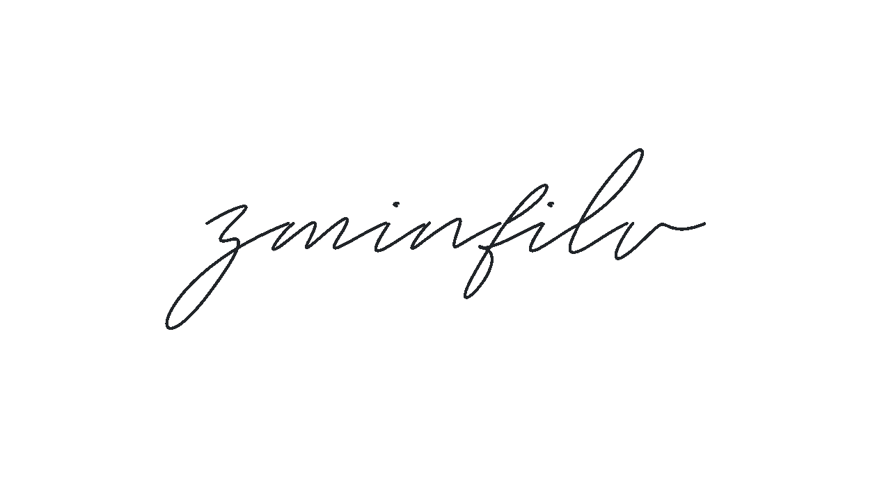
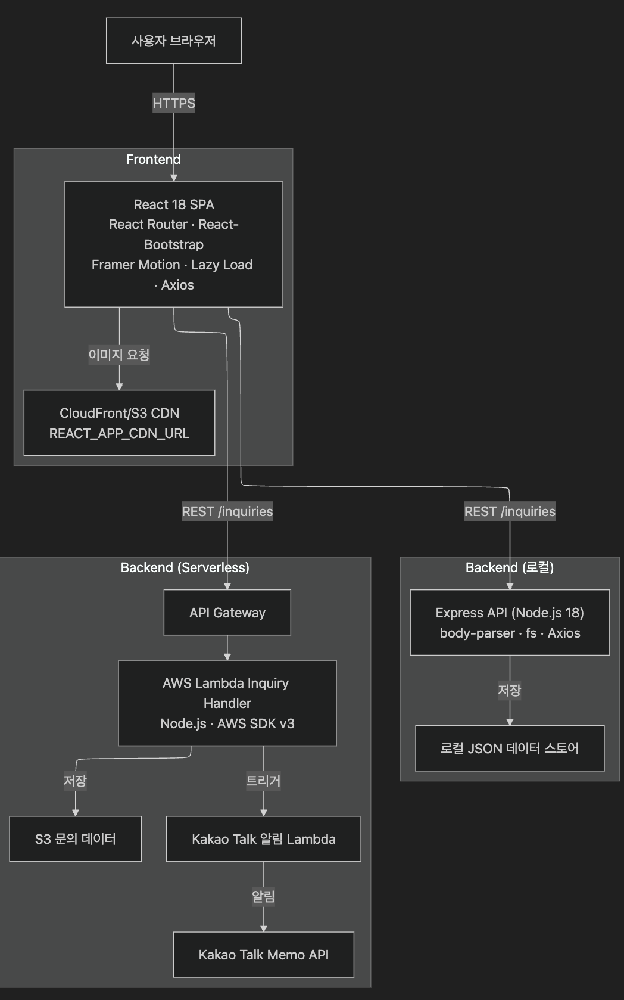

# Yoonmin Film Archive

<div align="center">
  
</div>

> **사진 아카이브 플랫폼** — 작품과 커머셜 작업을 한곳에 담아내는 디지털 갤러리

## 📖 프로젝트 소개

Yoonmin Film Archive는 사진 작가 윤성민의 디지털/필름 작품과 커머셜 프로젝트를 한곳에 모아 전시하는 **풀스택 웹 애플리케이션**입니다.

- 🖼️ 카테고리별 작품 갤러리 (디지털 / 필름 / 도시 패턴 등)
- 📱 모바일 & 데스크톱 반응형 UI
- 📮 자동화된 문의 접수 및 카카오톡 알림
- ☁️ AWS Serverless 기반 백엔드 인프라

## ✨ 주요 기능

| 기능 | 설명 |
|------|------|
| **몰입형 갤러리** | Masonry 그리드와 모달 뷰로 작품 감상. JSON 메타데이터 기반 섹션 관리 |
| **지연 로딩 & 애니메이션** | `react-lazy-load-image-component`와 Framer Motion으로 부드러운 전환 |
| **자동 문의 응답** | 폼 전송 시 S3 저장 + 카카오톡 실시간 알림 |
| **CDN 기반 이미지 제공** | CloudFront/S3를 통한 빠른 이미지 로딩 |

## 🛠 기술 스택

<div align="center">
  
  
  
</div>

| 구분 | 사용 기술 |
|------|-----------|
| **Frontend** | React 18, React Router, React-Bootstrap, Framer Motion, Axios |
| **Backend (로컬)** | Node.js, Express, body-parser, Axios |
| **Backend (Serverless)** | AWS Lambda, API Gateway, S3, AWS SDK v3 |
| **Infra & 기타** | CloudFront/S3 CDN, Kakao Talk Memo API, Vercel Analytics |

## 🏗️ 시스템 아키텍처

<div align="center">
  
</div>

## 📁 프로젝트 구조

```text
yoonminFilmArchive/
├── FrontEnd/                    # React SPA
│   ├── public/
│   │   └── imageJson/           # 작품 메타데이터 JSON
│   └── src/
│       ├── components/          # 공통 컴포넌트 (Navbar, Footer, Overlay)
│       ├── config/              # CDN URL 헬퍼
│       ├── features/            # 페이지별 기능 모듈
│       │   ├── mainPage/        # 메인 페이지
│       │   ├── projectPage/     # 프로젝트 갤러리
│       │   ├── aboutPage/       # About 페이지 & 문의 폼
│       │   └── shopPage/        # Shop 페이지 (확장 예정)
│       └── assets/              # 정적 리소스
│
├── BackEnd/                     # Node.js & Serverless
│   └── api/
│       ├── inquiry/             # 문의 API (Express & Lambda)
│       ├── kakaoTalkAlam/       # 카카오 알림 API (Express & Lambda)
│       └── shopInfo/            # Shop 관련 API
│
├── ProjectImageStorage/         # 원본 이미지 보관 (배포 미포함)
│
└── README/                      # 상세 문서 및 이미지
```

## 🔮 향후 개선 아이디어

- [ ] Shop 페이지 기능 구현 및 재고/주문 관리 연동
- [ ] 문의 API 인증 (Recaptcha, Rate Limiting) 추가
- [ ] Admin 콘솔 구축으로 이미지/메타데이터 관리 자동화
- [ ] Express와 Lambda 코드 통합으로 서버리스 전환 일관성 강화

## 📞 연락처

- **GitHub Issues**: [Issues](https://github.com/yoonmins/yoonminFilmArchive/issues)
- **문의**: yoonmin.tech@gmail.com
