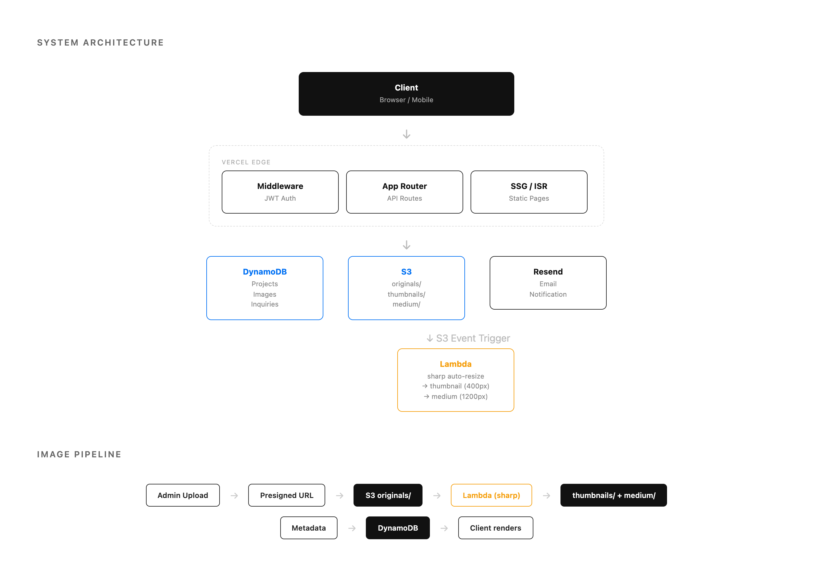

# Yoonmin Film Archive

  
    
  <a href="https://www.yoonminfilm.co.kr"><strong>www.yoonminfilm.co.kr</strong></a>

 

## About

Yoonmin Film Archive는 사진 작가 윤성민의 오리지널 작품을 큐레이팅하는 디지털 갤러리입니다.

필름과 디지털로 담아낸 도시의 빛, 여행의 순간, 사람의 온도를 한곳에 모아 전시합니다. 단순한 포트폴리오를 넘어, 각 프로젝트의 맥락과 이야기를 카테고리별로 탐색할 수 있는 아카이브 형태로 구성되어 있습니다.

사진이 가진 고유한 비율과 톤을 최대한 보존하는 것을 지향하며, 포토 저널 스타일의 레이아웃으로 작품을 감상할 수 있습니다.

 

## Tech Stack

  
  
  
  
  
  
  

 

| Layer | Technology |
|-------|-----------|
| **Frontend** | Next.js 16 (App Router), React 19, Framer Motion |
| **Styling** | Tailwind CSS v4, Pretendard Variable Font |
| **Database** | DynamoDB (Single Table Design) |
| **Storage** | S3 (presigned upload, public read) |
| **Image Processing** | Lambda + sharp (auto resize on upload) |
| **Auth** | JWT (HttpOnly cookie) + bcrypt |
| **Notification** | Resend (email on inquiry) |
| **Deploy** | Vercel (frontend) + AWS Lambda (image resize) |

 

## Architecture

  

 

## Features

### Photo Book Carousel
메인 페이지에서 프로젝트별 이미지를 저널 스타일 그리드로 자동 회전합니다. 여러 레이아웃 템플릿 중 랜덤으로 선택되어 매번 다른 구성으로 보여주며, 다음 슬라이드의 이미지를 미리 로드하여 부드러운 전환을 제공합니다.

### Category-based Project View
하나의 프로젝트 안에서 카테고리(예: Paris, Italy, Swiss)별로 작품을 구분합니다. 우측 네비게이션으로 카테고리 간 빠른 이동이 가능하고, 스크롤 위치를 IntersectionObserver로 추적하여 현재 보고 있는 카테고리를 자동으로 하이라이트합니다.

### Admin Dashboard
프로젝트 생성/수정/삭제, 이미지 업로드(drag & drop), 카테고리 관리, 문의 관리를 지원합니다. 데이터 변경 시 Next.js 캐시를 자동 갱신(revalidatePath)하여 프로덕션 사이트에 즉시 반영됩니다.

### Image Pipeline
관리자가 이미지를 업로드하면 S3 presigned URL로 `originals/`에 직접 저장됩니다. S3 이벤트 트리거로 Lambda가 자동 실행되어 sharp로 두 가지 크기의 WebP 이미지를 생성합니다.

- `thumbnails/` — 400px width, WebP q80
- `medium/` — 1200px width, WebP q85

### Inquiry System
About 페이지의 문의 폼을 통해 촬영 문의를 접수합니다. DynamoDB에 저장되고 Resend를 통해 이메일 알림이 전송됩니다. 스팸 방지를 위해 일일 50건, 주간 200건의 rate limit이 적용됩니다.

 

## Database Schema

**Single Table Design** — 하나의 테이블(`yoonminfilm`)에 모든 엔티티를 저장합니다.

| Entity | PK | SK | GSI1PK | GSI1SK |
|--------|----|----|--------|--------|
| Project | `PROJECT` | `PROJECT#<order>#<id>` | `SLUG#<slug>` | `PROJECT#<order>` |
| Image | `PROJECT#<id>` | `IMAGE#<order>#<imgId>` | — | — |
| Inquiry | `INQUIRY` | `INQ#<time>#<id>` | — | — |

 

## Security

| Layer | Implementation |
|-------|---------------|
| API Auth | JWT middleware — 모든 write API 인증 필수 |
| Password | bcrypt hash (HttpOnly, Secure, SameSite cookie) |
| S3 Write | presigned URL only (10분 유효) |
| S3 Read | public (이미지 CDN 용도) |
| Rate Limit | 문의 POST 50/day, 200/week |
| Secrets | 환경변수 (.gitignore, Vercel encrypted) |

 

## Version History

### V2 — 2026.05 (Current)
Next.js 풀스택 재구축.

- Next.js 16 App Router + TypeScript + Tailwind CSS v4
- DynamoDB Single Table Design
- Admin 대시보드 (프로젝트 CRUD, 이미지/카테고리 관리)
- S3 presigned upload + Lambda 자동 리사이즈
- JWT 인증 + middleware API 보호
- Photo book 스타일 메인 캐러셀
- Resend 이메일 알림
- Vercel + 커스텀 도메인 (yoonminfilm.co.kr)

### V1 — 2024.11 ~ 2025.11
React CRA + AWS Serverless 초기 버전.

- React 18 SPA (CRA) + Bootstrap
- Express + Lambda (Serverless Framework)
- S3 JSON 파일 기반 데이터 저장
- 카카오톡 알림 연동

 

## Contact

- **Site**: [www.yoonminfilm.co.kr](https://www.yoonminfilm.co.kr)
- **Email**: yoonmin.tech@gmail.com
- **Instagram**: [@yoonmin_film](https://www.instagram.com/yoonmin_film/)
